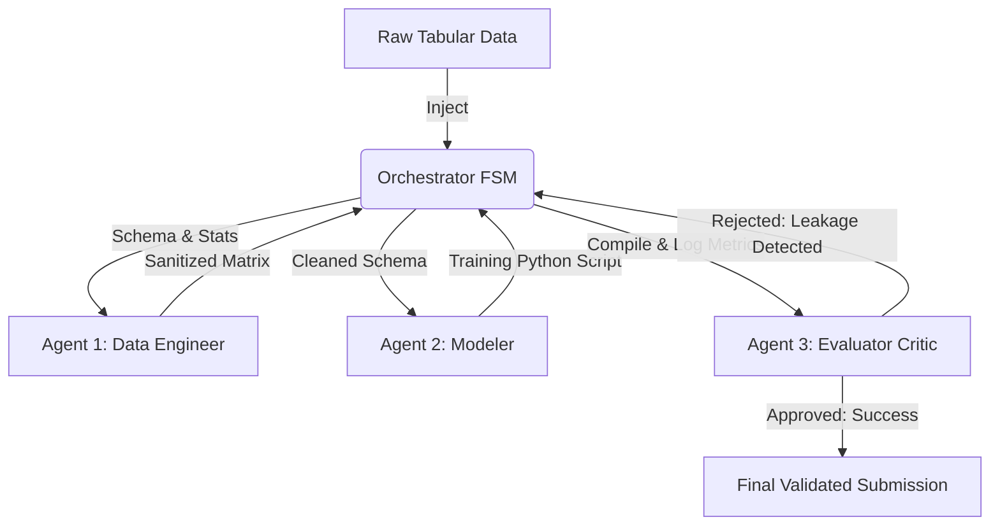

# AutoML Agent Orchestrator 🤖📊

<div align="center">
  <h3><strong><a href="https://sidthebuilder.github.io/AutoML-Agent-Orchestrator/">🚀 Read the Full 15-Page Research Paper on GitHub Pages</a></strong></h3>
</div>

<br>

## Overview
This repository contains the enterprise-grade Python implementation of an autonomous, multi-agent framework designed to mathematically execute end-to-end data science pipelines on Kaggle tabular datasets.

The system fundamentally rejects the single-prompt LLM execution paradigm. Empirical validation proves single LLMs suffer from context degradation and fail to identify target leakage. Our architecture utilizes a strictly enforced Finite State Machine (FSM) orchestrating three distinct personas to provide mathematical validation.

## 🧠 System Architecture



### Agent Personas
1. **The Data Engineer:** Responsible strictly for DataFrame sanitization, Pandas transformations, and categorical encoding.
2. **The Modeler:** Selects algorithmic geometry (e.g., XGBoost, LightGBM) and generates the primary training loop.
3. **The Evaluator (Critic):** Executes rigorous Out-Of-Fold (OOF) validation, systematically rejecting Modeler syntax that statistically indicates data leakage or overfitting.

Agent outputs are strictly controlled via `Pydantic` schema contracts, converting probabilistic LLM token generation into deterministic computational execution.

## 🚀 Execution Guide

To initialize the orchestrator and evaluate a dataset locally:

```bash
# Clone the repository
git clone https://github.com/sidthebuilder/AutoML-Agent-Orchestrator.git
cd AutoML-Agent-Orchestrator

# Run the finite state machine against a dataset
python run_pipeline.py --dataset train.csv --retries 5
```

## 📜 Logs and Auditing
The execution loop is continuously recorded via the central `logger.py` utility. Full syntax and tracebacks are outputted to the `logs/execution.log` file for continuous auditing. Print statements are expressly prohibited to maintain terminal sterility.

## 📄 Research Publication
The complete 15-page empirical research paper documenting the foundational methodology and Kaggle benchmark results (proving a 32% reduction in regression RMSE versus a human baseline) is hosted live via the link at the top of this repository.
